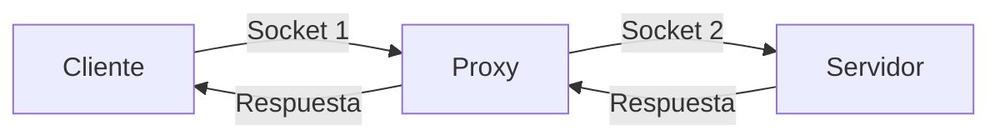

# Creando nuestro proxy server!!!

Este repositorio dedicado a la primera actividad se ordeno en la siguiente estructura:

- server: Mantiene la informacion de los servidores creados. (`main_server.py` -> usado en parte 1; `proxy.py` -> usado en parte 2)
- static: Alberga la informacion de los html creados para el proposito de las actividades, ademàs de `config-json` que es importante para la parte 2.

- utils: Codigo reutilizable y/o funciones auxiliares documentadas.

No se comentara sobre la parte 1 ya que es introductoria a la parte 2.

## ¿Como correr mi proxy?
Para correrlo, ya que tuve que crear modulos porque en un principio tenia unos problemas de conflicto al correrlo con `main_server.py`, deben situarse en la carpeta del proyecto y luego ejecutar esta linea para que funcione:

    python3 -m server.proxy

Esto nos permitira correr el server sin ningun problema.

## Sobre el proxy
Aspectos relevantes sobre el mecanismo de funcionamiento es que realice un ciclo de ejecucion:
- Creamos socket proxy y esperamos en el puerto 8080.
- Recibimos request del cliente.
- Revisamos que sea una uri valida la solicitada por el cliente.
    - En caso de error, renderizamos pagina correspondiente.
- Luego agregamos header y enviamos mensaje al servidor.
- Esperamos response del servidor.
- Cambiamos las palabras prohibidas .
- Enviamos al cliente.
- Cerramos ambos canales.

La eleccion del puerto 8080 para el proxy fue porque pense que era uno mas adecuado. Al inicio tuve confusiones con el enunciado.

Por cierto ya que mi codigo esta en este puerto es importante recordarles que no se olviden de cambiarlo al ejecutar en navegador.

Para ejecutar comandos con `curl [domain] -x [proxy]` no olvidar que deberia colocar como proxy `localhost:8080`.

## Sobre los experimentos

Al acceder a `http://cc4303.bachmann.cl/secret` obtiene la pagina de error y se envia la response correspondiente a un html con informacion sobre la pagina web de error, tanto como en el navegador y usando el comando `curl`.

Al acceder a la pagina `http://cc4303.bachmann.cl/` y `http://cc4303.bachmann.cl/replace` se obtiene los cambios solicitados por las palabras prohibidas, y nuestro nombre se agrega exitosamente a la pagina para la primera pagina.

Sobre el experimento modificando el buffer no se obtiene ningun problema destacable, aunque podemos mencionar lo siguiente acerca de los diferentes valores de `buff_size`:
- De tamaño pequeño el mensaje suele demorar un par de segundos (ex: 4 fue el que use para toda la tarea).
- De tamaño mediano se queda esperando a lo mucho un minuto (ex: 128 fue el que utilice).
- De tamaño grande se quedaba esperando mas debido a que como realiza menos llamas por buffer, si que se queda espera mas para para que se complete el buffer (ex: 4096 fue el que utilice).

Puede ser que mi logica de algunas funciones pueda influir en la velocidad con la que respondia o el uso de VM. Aun asi conforme mas subia la cantida de bits mas esperaba.

## Diagrama proxy-server

Estos dos proxys simbolizan la conexion realizada entre canales de comuncacion.